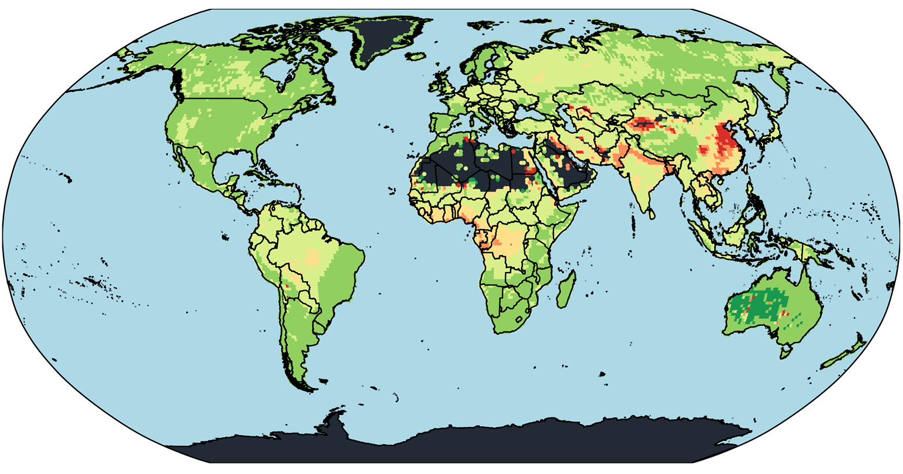

---

##### Download

+ [Paper](https://fanwangecon.github.io/assets/GlobalPollutionBurden_SantosEtAl.pdf)
<!-- + [Online appendix](appendix1.pdf) -->
<!-- + [Code and data](https://github.com/pmichaillat/job-rationing) -->

---

##### Abstract

We analyze the global population-weighted distribution of air pollution by aerosols and its relationship to GDP per capita. We first decompose the global distribution and consider both variations across and within regions and countries. Second, we map national and subnational distributions of air pollution by aerosols to national and subnational distributions of GDP per capita. We find considerable global exposure inequalities. Comparing continents at the extremes, the average individual in Asia is 3.32 times more exposed to air pollution by aerosols than the average individual in Oceania. In Africa and Asia, populations at the 80th percentile of the air pollution by aerosol distribution are 141% and 109% more exposed than population at the 20th percentile, and those at the 90th percentile are 227% and 185% more exposed those at the 10th percentile. Globally, we find that a doubling of GDP per capita is associated with a 11.8 percentage points reduction in the percentage deviation between a subnational unit’s population-weighted air pollution by aerosol level and the global population-weighted mean. Within each continent, exploiting variabilities in subnational data after controlling for aggregate regional variabilities, we find positive associations between air pollution by aerosols and GDP per capita in Africa and Europe, but negative association in the Americas, Asia, and Oceania.

---

##### Air pollution burden distribution in the world



<!-- ---

##### Citation

Author. Year. "Title." *Journal* Volume (Issue): First page–Last page. https://doi.org/paper_doi.

```BibTeX
@article{AAYY,
author = {Author},
doi = {paper_doi},
journal = {Journal},
number = {Issue},
pages = {XXX--YYY},
title ={Title},
volume = {Volume},
year = {Year}}
``` -->

---

##### Related material

+ [Poster](Poster_PAA.pdf) - Best Poster award PAA 2024

