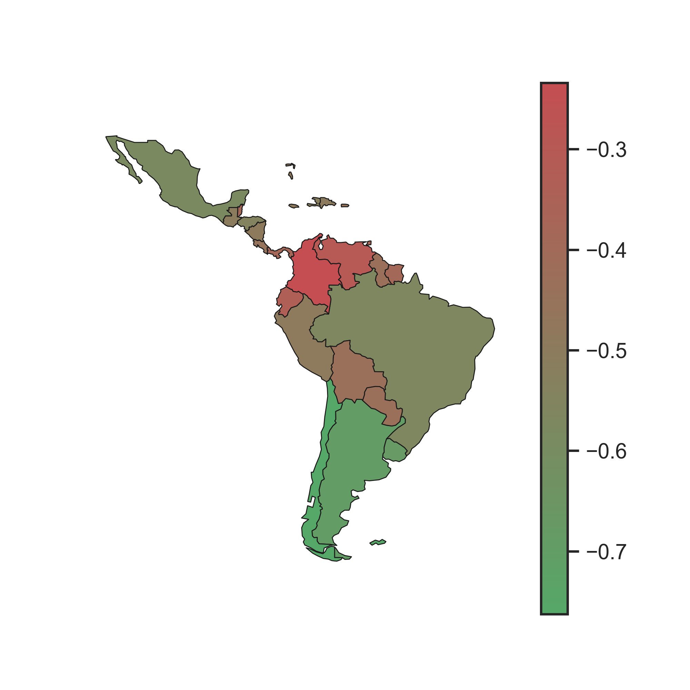

<!-- --- -->

<!-- ##### Download -->

<!-- + [Paper](paper2.pdf)
+ [Online appendix](appendix2.pdf)
+ [Code and data](https://github.com/pmichaillat/unemployment-gap) -->

<!-- --- -->

<!-- ##### Abstract -->


<!-- --- -->

<!-- ##### Excess burden of air pollution in LAC -->



<!-- --- -->
<!-- 
##### Citation

Author 1 and Author 2. Year. "Title." *Journal* Volume (Issue): First page–Last page. https://doi.org/paper_doi.

```BibTeX
@article{AAYY,
author = {Author 1 and Author 2},
doi = {paper_doi},
journal = {Journal},
number = {Issue},
pages = {XXX--YYY},
title ={Title},
volume = {Volume},
year = {Year}}
``` -->

<!-- --- -->

<!-- ##### Related material

+ [Presentation slides](presentation2.pdf) -->

